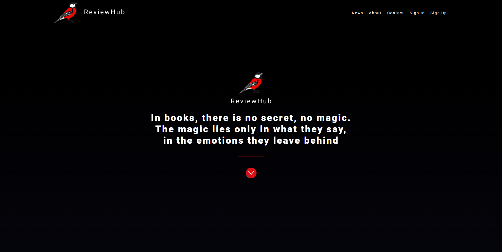
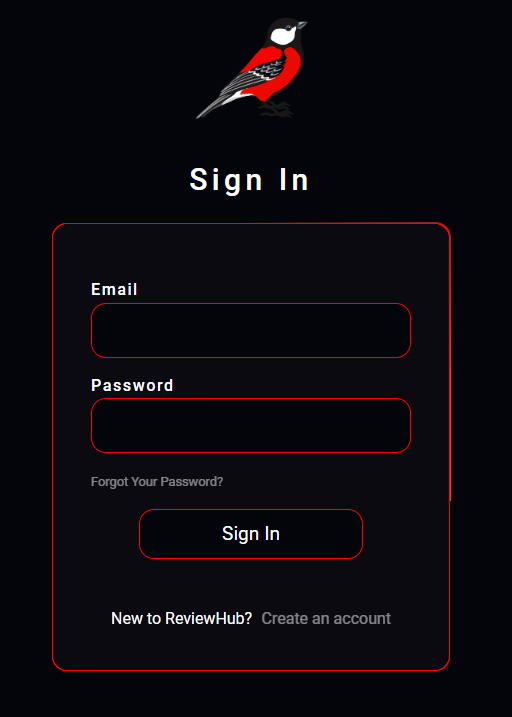
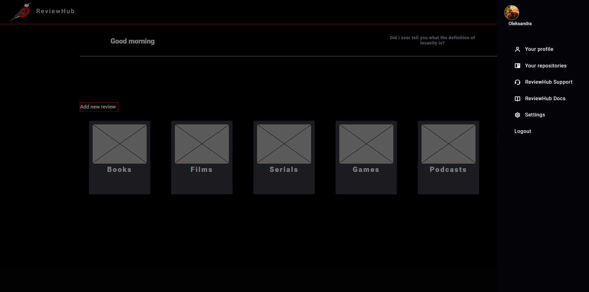
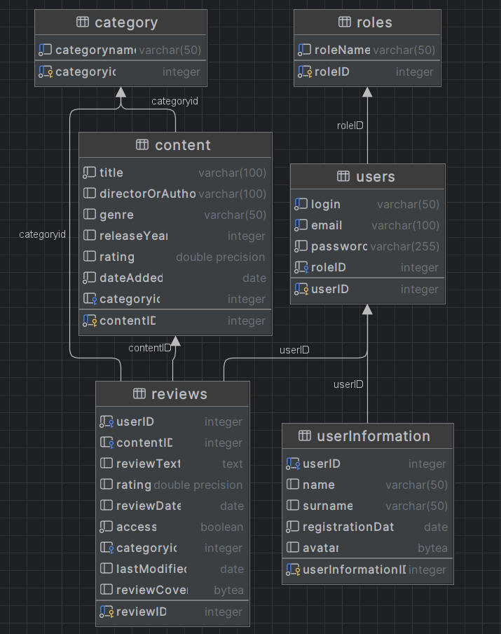

# Review Repository (ReviewHub)

Welcome to the **ReviewHub** project! This web application is designed for conveniently storing and managing reviews for various products, movies, books, or other items.

## Table of Contents

1. [Project Overview](#project-overview)
2. [Views](#view)
3. [Technologies Used](#technologies-used)
<!-- 4. [Installation and Running](#installation-and-running) -->
<!-- 5. [How to Use](#how-to-use) -->
<!-- 6. [Contributing](#contributing) -->

## Project Overview

The project allows users to save their opinion about a book they read, a movie they watched, or anything else. Convenient search will allow you to quickly find and recommend something from your repository to someone. Also, thanks to recordings, you can quickly refresh your memory.

## View

- Hello page:


------------
- Login form:




-----------


- Main page with categories and superowe sidebar-menu:


## Technologies Used

The project is developed using a variety of technologies:

- **Frontend**:
  - ``HTML``, `CSS`, `JavaScript`


- **Backend**:
  - Server-side programming language (`PHP`)
  - Database management system (`PostgreSQL`)

- **Containerization**:
  - [Docker](https://www.docker.com/)

<!-- ## Installation and Running

To set up the project locally, follow these steps:

1. Clone the repository to your local computer:

   ```shell
   git clone https://github.com/yourusername/your-project.git -->


### Diagram ERD:



